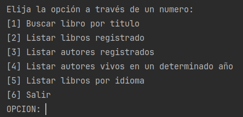
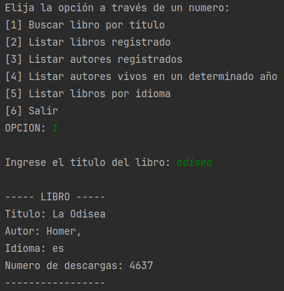
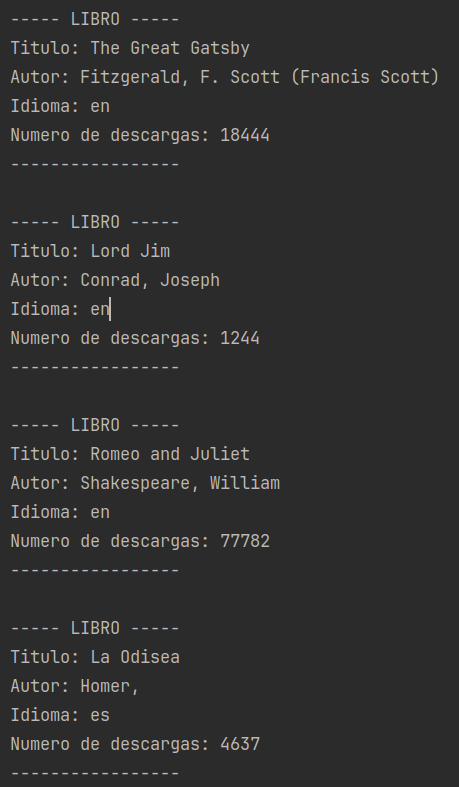
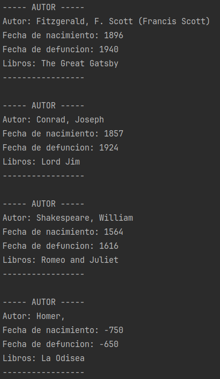
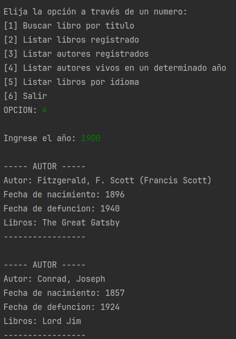
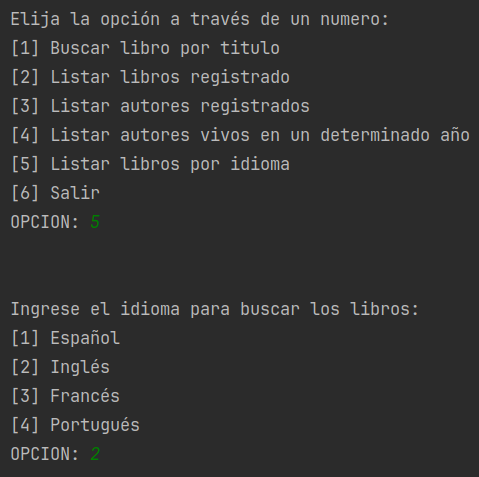
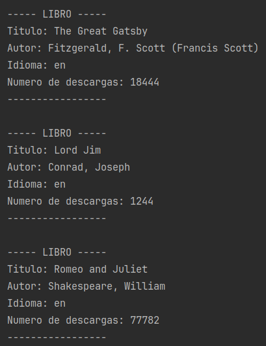

# LITERALURA  
Aplicacion de consola que consulta la API de gutendex.com. Utiliza Spring Boot asi como PostgreSQL para la base de datos  
  
### ENTIDADES  
Se crearon 2 entidades, cuya cardinalidad es 1 - 1
1. Autor  
Tiene los siguientes atributos  
    - Integer id
    - String nombre
    - String apellido
    - Integer fechaNacimiento 
    - Integer fechaFallecimiento
    - Libro libro
2. Libro  
Tiene los sigueintes atributos
    - Integer id 
    - String titulo
    - Autor autor
    - String idioma 
    - Integer numDescargas

### BASE DE DATOS
Se utilizó docker compose para crear la base de datos a partir de la imagen de PostgreSql  
El archivo respectivo es `docker-compose.yml`  
Automaticamente crea la base de datos `biblioteca`  
Para levantar la base de datos debe ejecutar el comando: `docker compose up`

### FUNCIONALIDADES  
- Cuando el usuario busca por un libro el programa consultrá la base de datos, si existe entonces es devuelto; de lo constrario consultara la API, obtendra el primer resultado, es insertado en la base de datos y finalmente es devuelto  
- El programa lista los libros registrados en la base de datos
- El programa lista los autores registrados en la base de datos
- El programa permite filtrar libros por idioma
- EL programa permite listar autores que estuvieron vivos en un determinado año

### DEMOSTRACIÓN  
- Vista del menu  

- Buscar libro por titulo  
  
- Listar libros registrados  

- Listar autores registrados

- Listar autores vivos en un determinado año

- Listar libros por idioma
  
  
- Salir
Esto termina el programa
